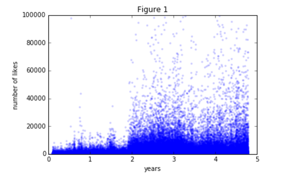
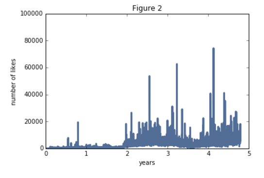
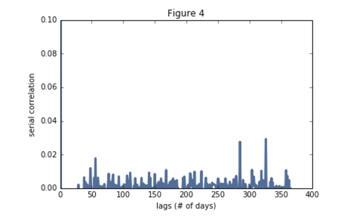

# Is There a Seasonality in Number of Likes for Social Media Posts?
## Data Science Spring 2017, Olin College of Engineering, Sung Park

Using a dataset containing over 4 million facebook posts from 15 mainstream news outlets, I investigate the existence of seasonality in the number of likes a facebook post from a news outlet gets. The dataset contains contents and attributes, such as number of likes and timestamp, of all facebook posts posted by the top media sources from 2012 to 2016. The media outlets included in the data are ABC, BBC, CBS, CNN, Fox & Friends, Fox, LA Times, NBC, NPR, The Huffington Post, The New York Times, The Wall Street Journal, The Washington Post, Time, and USA Today. The dataset was produced by Patrick Martincheck, as a part of his [article on analysis of Facebook posts about Hillary Clinton and Donald Trump](https://shift.newco.co/what-i-discovered-about-trump-and-clinton-from-analyzing-4-million-facebook-posts-922a4381fd2f), and the dataset can be downloaded through [data.world](https://data.world/martinchek/2012-2016-facebook-posts).
## Methodology

I extract the number of likes and timestamp from all posts in the dataset. The dataset is structured into several separate collections of posts from different media outlets, so I end up with collections of number of likes and timestamps, in which each collection represents a different media outlet. I then convert each timestamp into a numerical 'years' value, which is a number of years since the time first post from the corresponding media outlet was posted.

The example of how my data looks like is shown in Figure 1 with a scatter plot of the number of likes the Huffington Post's Facebook posts got over the years.

**Figure 1: Scatter plot of number of likes the Huff Post's Facebook posts received.**

 In order to accurately investigate the existence of seasonality, I subtract the trend from my data. To do this, I compute the residuals by subtracting exponentially weighted moving average from the time series of number of likes. The plot of EWMA and residuals for the Huffington Post are shown in Figure 2 and 3, respectively.

 

**Figure 2: The Exponentially Weighted Moving Average of the number of likes the Huff Post's Facebook posts received**

 

**Figure 3: The residuals of the Huff Post's number of likes**

 Lastly, I compute an autocorrelation function for the residuals and investigate the serial correlation values for lag of 1, 7, 30, and 365 days. The plot of the serial correlation values for the range of 0 day lag to 365 days lag is shown below in Figure 4.

 

 **Figure 4: The serial correlation values of the number of likes that the Huffington Post's Facebook posts received.**

## Results and Intepretation

Following is a table summarizing the serial correlation values of the number of likes from different media outlets.

| Media Outlet | 1 Day | 7 Days | 30 Days | 365 Days |
| --- | --- | --- | --- | --- |
| CNN | **-0.0297** | -0.000478 | -0.000688 | -0.00254 |
| The Huff Post | 0.0144 | -0.0261 | -0.00797 | -0.000195 |
| LA Times | **-0.0311** | -0.00899 | -0.00421 | -0.00368 |
| NPR | -0.0274 | -0.0258 | -0.00658 | -0.00637 |
| NBC | -0.0194 | -0.0282 | -0.00653 | 0.00509 |
| Fox | -0.00430 | -0.00845 | -0.000743 | -0.0123 |
| Fox and Friends | -0.00401 | **-0.0315** | -0.00205 | 0.00591 |
| CBS | **-0.0316** | -0.0217 | -0.00240 | 0.00103 |
| BBC | **-0.0304** | -0.0117 | 0.00196 | -0.0100 |
| ABC | -0.0149 | -0.0275 | -0.0135 | -0.00419 |
| WSJ | -0.0274 | -0.0164 | -0.00695 | -0.00272 |
| NYT | -0.0147 | -0.000804 | -0.00233 | 0.00641 |
| The Washington Post | -0.0201 | -0.0273 | -0.0140 | -0.00139 |
| Time | -0.0213 | -0.0172 | -0.00835 | -0.00406 |
| USA Today | -0.0246 | -0.0196 | -0.0160 | -0.00683 |

All serial correlation values are small, indicating that there is no significant daily, weekly, monthly, or yearly serial correlation. 

## Conclusion
When I compute the serial correlation values for the time series of the number of likes, the computed values are very small. Small serial correlation values suggest that there is seasonality of any sort among number of likes that a media outlet's social media posts get. 

A link to Jupyter notebook with code for analysis presented above can be found [here](https://github.com/SungwooPark/ThinkStats2/blob/master/code/report2.ipynb)