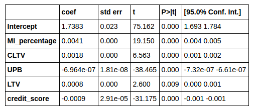
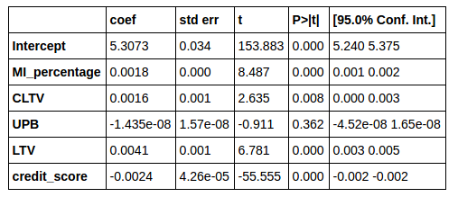

# Is Terms of Home Mortage Less Favorable Now Compared to That of Pre-subprime Nortagage Crisis in 2007?
## Sung Park, Olin College of Engineering '19, Data Science Spring 2017

It is well known fact that excessive amount default from subprime mortages, which are mortagages normally issued to a borrower of low credit, was a leading cause of subprime mortagage crisis that led to a global financial meltdown in 2007 and 2008. Because of this nightmarish experience, it seems plausible to assume that contemporary home mortagages are much harder to get and much conservative (in terms of risks the lender is taking, shown mainly as an interest) than those of pre-2007 mortagages. Using a dataset containing all home mortagages purchased or guaranteed from The Federal Home Loan Mortgage Corporation, more commonly known as Freddie Mac, I attemp to answer above question.

## Methodology

The dataset contains a list of all home mortagages purchased or guaranteed from Freddie Mac between the period of 1999 to 2016. Along with each mortagage, the dataset provides a number of useful attributes, such as interest rate, [loan to value ratio (LTV)](https://en.wikipedia.org/wiki/Loan-to-value_ratio), [combined loan to value (CLTV)](http://www.investopedia.com/terms/c/combinedloantovalue.asp), [mortgage insurance percentage (MI%)](https://en.wikipedia.org/wiki/Mortgage_insurance), and [unpaid principal balance (UPB)](https://en.wikipedia.org/wiki/Unpaid_principal_balance).

For my analysis, I define how favorable a home mortagage is by looking at an interest rate of a mortagage. If there are two mortgages with same conditions (same amount of loan taken relative to property price, amount of insurance, etc), the mortgage with lower interest rate can be said to be more favorable. On the other hand, the mortgage with higher inteerest rate can be said to be less favorable to a borrower and more conservative for a lender because a lender is taking a less risk by charging higher interest rate.

In order to guage the sense of how interest rate is affected by other conditions of the loan, I ran a regression on the sample of 50000 loans from 2006 and 2015, with interest rate as a dependent variable and all other attributes as independent variables. 

## Results and Interpretation

Following is a result of regression on 2006 sample dataset.

 

 **The result of regression on 2006 dataset**

 The adjusted r-square value for above regression was 0.087.

 Following is a result of regression on 2015 sample dataset.

 

 **The result of regression on 2015 dataset**

 The adjusted r-square value for above regression was 0.124.