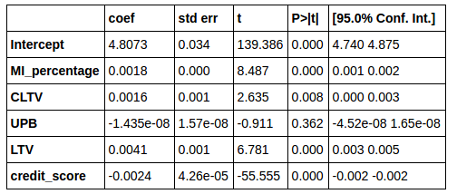

# Is Terms of Home Mortage Less Favorable Now Compared to That of Pre-subprime Nortagage Crisis in 2007?
## Sung Park, Olin College of Engineering '19, Data Science Spring 2017

It is well known fact that excessive amount of default from subprime mortages, which are mortagages normally issued to a borrower of low credit, was a leading cause of subprime mortagage crisis that led to a global financial meltdown in 2007. Because of this nightmarish experience, it seems plausible to assume that current home mortagages are much harder to get and much more conservative (in terms of risks the lender is taking, shown mainly as an interest rate) than pre-2007 mortagages. Using a [dataset](http://www.freddiemac.com/news/finance/sf_loanlevel_dataset.html) containing all home mortagages purchased or guaranteed from The Federal Home Loan Mortgage Corporation, more commonly known as Freddie Mac, I investigate whether there is any noticeable difference between the interest rates before and after subprime mortgage crisis.

## Methodology

The dataset contains a list of all home mortagages purchased or guaranteed from Freddie Mac between the period of 1999 to 2016. Along with each mortagage, the dataset provides a number of useful attributes that describes the nature of a loan, such as interest rate, [loan to value ratio (LTV)](https://en.wikipedia.org/wiki/Loan-to-value_ratio), [combined loan to value (CLTV)](http://www.investopedia.com/terms/c/combinedloantovalue.asp), [mortgage insurance percentage (MI%)](https://en.wikipedia.org/wiki/Mortgage_insurance), and [unpaid principal balance (UPB)](https://en.wikipedia.org/wiki/Unpaid_principal_balance).

For my analysis, I define how favorable a home mortagage is by looking at an interest rate of a mortagage. If there are two mortgages with same conditions (same amount of loan taken relative to property price, amount of insurance, etc), the mortgage with lower interest rate can be said to be more favorable. On the other hand, the mortgage with higher inteerest rate can be said to be less favorable to a borrower and more conservative for a lender because a lender is taking a less risk by charging higher interest rate.

In order to guage the sense of how interest rate is affected by the conditions of the loan, I ran a regression on the sample of 50000 loans from 2006 and 2015, with interest rate as a dependent variable and all other attributes as independent variables. 

Since the [federal funds rate](https://en.wikipedia.org/wiki/Federal_funds_rate), which is the interest rate at which a depository institution like banks and credit unions lends funds maintained at the Federal Reserve to other depository institution overnight, serves as a basis of a bank's prime lending rate, I subtracted the federal funds rate from the interest rate. For 2006 dataset, the federal funds rate as of june 29th (5.25%) was used. For 2015 dataset, the federal funds rate as December 15th (0.5%) was used.

## Results and Interpretation

Following is a result of regression on 2006 sample dataset.

 

 **The result of regression on 2006 dataset**

 The adjusted r-square value for above regression was 0.087.

 Following is a result of regression on 2015 sample dataset.

 

 **The result of regression on 2015 dataset**

 The adjusted r-square value for above regression was 0.124.

 There is a large difference in the intercept of 2006 regression model and 2015 regression model. The intercept of 2006 model was 1.7383 while that of 2015 model was 4.8073, resulting in the difference of 3.0690. Considering that the federal funds rate, which is a representative value of the economic condition at the time, was already subtracted, this difference can be attibuted to the shift in the nature of bank's loans, rather than the reflection of the economic condition at the time. Higher intercept level of 2015 model than 2006 model suggests that the interest rate of a loan, when other conditions being equal, will be more likely to be higher in 2015. It seems plausible to say that higher "base" interest rate in 2015 shows that banks in 2015 were much more conservataive in their lending than 2006. 

 Other values that had a relatively large varaiation between 2006 model and 2015 model was a coefficient of credit score variable. In 2006 model, the coefficient was -0.0009, which meant 1 point higher credit rating translated to -0.0009% drop in the interest rate. The credit_score coefficient for 2015 model is -0.0024, which is 0.0015 higher in magnitude than the coefficient of 2006 model. The relatively smaller effect of credit rating in 2006 model compared to 2015 model can interpreted as a sign that lending institutions put less emphasis on the credit rating of a borrower in 2006 than in 2015. In more colloquial terms, it seems like banks cared less about whether a borrower had a good credit or bad credit when giving out a loan in 2006 compared to 2015.

 Jupyter notebook with a code that was used for this analysis can be found [here](https://github.com/SungwooPark/ThinkStats2/blob/master/code/report3.ipynb).